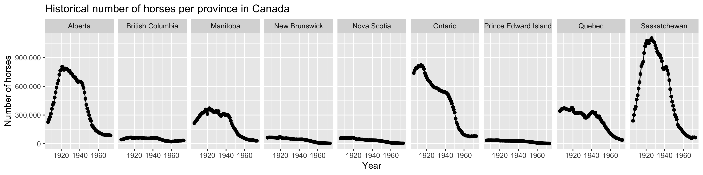

# Historical horse population in Canada
Plot that shows historical population of horses in Canada between 1906 and 1972. Specifically, it creates this plot:

Horse population data were sourced from the [Government of Canada's Open Data webiste](http://open.canada.ca/en/open-data). Specifically, these two sources were used:
- [Horses, number on farms at June 1 and at December 1](http://open.canada.ca/data/en/dataset/43b3a9b3-3842-45e7-8bc8-c4c27b9462ab)
- [Horses, number on farms at June 1, farm value per head and total farm value](http://open.canada.ca/data/en/dataset/b374f60b-9580-44dc-83f6-c0a850c15f30)

## Dependencies:
- R and R packages:
  - tidyverse

## Instructions to run:
1. clone or download this repository
2. open RStudio and set this project root as the working directory
3. type `source("src/plot_horses.R")` or run the script interactively through the editor
